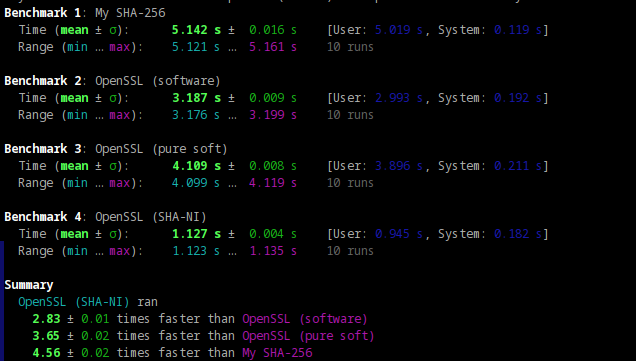
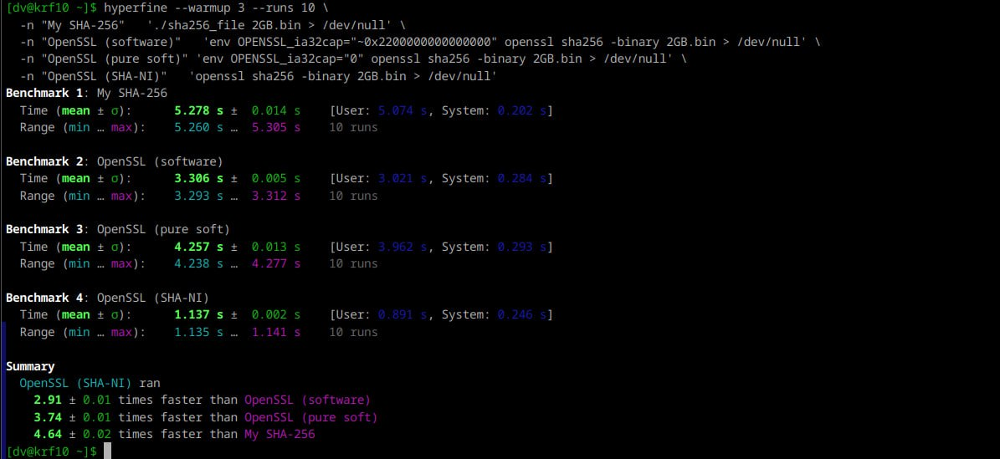

# Create a 1KB file (1024 bytes)

```bash
dd if=/dev/urandom of=1KB.bin bs=1024 count=1 2>/dev/null
```

# Create a 1MB file (1048576 bytes)

```bash
dd if=/dev/urandom of=1MB.bin bs=1048576 count=1 2>/dev/null
```

# Create a 10MB file

```bash
dd if=/dev/urandom of=10MB.bin bs=1048576 count=10 2>/dev/null
```

# Create a 2GB file

dd if=/dev/urandom of=2GB.bin bs=1M count=2048 2>/dev/null

## Check

```bash
./sha1_file 2GB.bin
./openssl sha1 2GB.bin
```

## Bench SHA1

```bash
hyperfine --warmup 3 --runs 10 \
  -n "My SHA-1"   './sha1_file 2GB.bin > /dev/null' \
  -n "OpenSSL"    'openssl sha1 -binary 2GB.bin > /dev/null'
```

## Bench SHA256

```bash
hyperfine --warmup 3 --runs 10 \
  -n "My SHA-256"   './sha256_file 2GB.bin > /dev/null' \
  -n "OpenSSL"    'openssl sha256 -binary 2GB.bin > /dev/null'
```

```bash
hyperfine --warmup 3 --runs 10 \
  -n "My SHA-256"   './sha256_file 2GB.bin > /dev/null' \
  -n "OpenSSL (software)"   'env OPENSSL_ia32cap="~0x2200000000000000" openssl sha256 -binary 2GB.bin > /dev/null' \
  -n "OpenSSL (pure soft)" 'env OPENSSL_ia32cap="0" openssl sha256 -binary 2GB.bin > /dev/null' \
  -n "OpenSSL (SHA-NI)"   'openssl sha256 -binary 2GB.bin > /dev/null'
```

## Ryzen 7 7700



## Ryzen 9 8945hx

